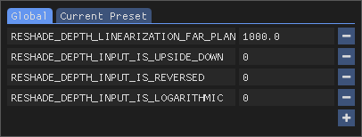
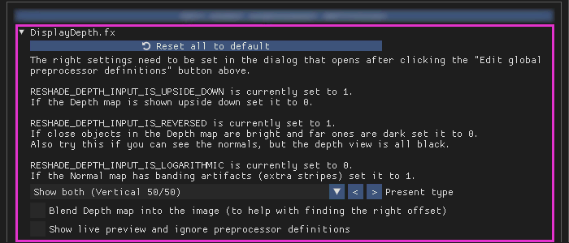

# Home

## Use Case
The "Home" tab contains the main functions of ReShade where users can enable, disable, and configure shaders they have installed. This section of the guide aims to break down the "Home" tab and provide more insight into what each button or section does.

---

## Preset Selection Bar

At the top of the ReShade "Home" tab is the preset selection bar. Here you can select, save, create, and manage your presets. By default, ReShade saves presets as `ReShadePreset.ini`.

## Shader Search and Sorting

Below the preset selection bar is the shader search function. It allows you to search through all shaders currently installed and visible to ReShade. To the right of the shader search are sorting buttons to organize your shaders.

## Shader List

The shader list provides you with all shaders installed for ReShade. Disabled shaders will have an empty square to the left of their name, while enabled shaders will have a checkmark.

## Edit Preprocessor Definitions

Below the shader list is the "Edit preprocessor definitions" section. Clicking this allows you to adjust global settings that can influence how shaders function.

Clicking on "Edit global preprocessor definitions" opens another window that allows you to modify specific preprocessor values used by shaders:

 

## Shader Parameters

The area below the shader list and preprocessor definitions section is the shader parameters list. Here you can configure the individual parameters for each shader you've enabled.

Each shader has unique settings; enabling a shader will display adjustable parameters here. Changes made are reflected in real-time, allowing for fine-tuning the appearance of your game.