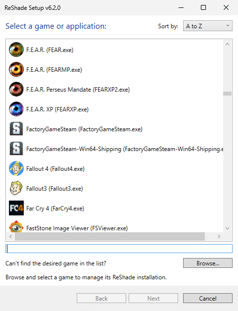
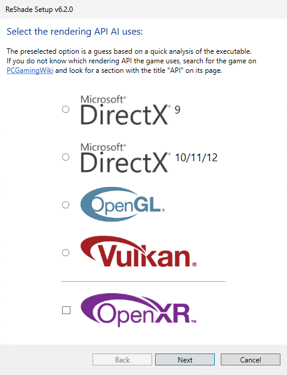
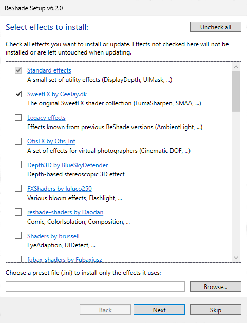
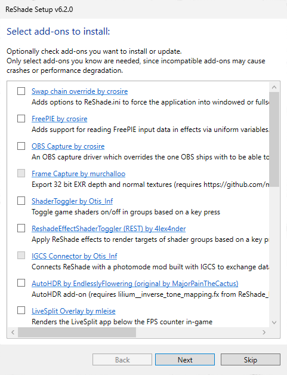

# ReShade Setup Tool 

## Use Case
The ReShade Setup Tool makes installing ReShade easy. While easy to use, it also offers powerful features, allowing you to download a variety of shaders and add-ons, making it a valuable tool for both new and returning users.

If you require help choosing the correct version of ReShade, visit [our guide for downloading ReShade](../downloading) for more information between the standard and add-on support versions.

---

## Selecting Your Game
When you open the ReShade Setup Tool, you’ll need to choose the game or application where you want to install ReShade. This step is essential, as picking the wrong app or file will prevent ReShade from properly injecting when your game starts. 

The tool displays a list of recent games and applications, making it easier to find what you need:

If your game isn’t listed, click the "Browse..." button at the bottom right corner of the setup tool. This will open a File Explorer window where you can manually find your game’s executable file. Executable files usually have the ".exe" extension and are often located in the main folder of the game’s installation directory.

If you’re unsure where to find your game's executable, you can check [our guide on finding your game’s executable and directory](/additionalguides/03findgameexecutable) for a step-by-step walkthrough.

## Selecting the Rendering API
Each game uses a different Rendering API, such as DirectX 9, DirectX 10/11/12, OpenGL, or Vulkan. In order to install ReShade properly, the setup tool needs to know which of the APIs your game uses. This choice is vital, as selecting the wrong API will prevent ReShade from injecting into your game.

If you don’t know which Rendering API your game uses, you can check [PCGamingWiki](https://pcgamingwiki.com), which often provides detailed information about the rendering methods.

## Installing Shaders
Shaders add effects like depth of field, ambient occlusion, bloom, and color grading, allowing you to customize the appearance of your game. 

Shaders in the ReShade Setup Tool are organized into groups called repositories. Each repository contains different shaders created by developers. To install shaders, select the repositories you want and click "Next." For more information about each repository, click the highlighted blue text that links to its description.

You can select as many repositories as you like in the Setup Tool, and if you’re unsure which repositories to pick, starting with repositories like SweetFX, qUINT, or iMMERSE is a good idea since it includes popular effects.

## Installing Presets
Presets can make your game look more cinematic, realistic, or stylized without needing to tweak each shader individually.

ReShade presets are stored in `.ini` files and let you use someone else’s visual settings. To install a preset, click "Browse" at the bottom of the shader installation screen and select your `.ini` file. The ReShade Setup Tool will identify and install all shaders used in that preset.

## Installing Add-ons (Add-on Support Only)
Add-ons are a new feature in ReShade that provide more options using the ReShade Add-on API. These add-ons are mainly for users who want to explore advanced features, such as special input controls or compatibility enhancements.

Add-ons may include experimental features that haven’t been fully tested, so be cautious when adding them. Make sure to read the provided descriptions or check the creator’s notes to understand what each add-on does. If an add-on causes problems, you can disable or remove it later from the ReShade settings.

## Finishing Up
When the ReShade Setup Tool completes the installation, a confirmation screen will appear. Click the "Finish" button at the bottom right, then start your game to ensure ReShade is installed properly. You should see a message at the top of the screen that says “ReShade is now installed successfully.”

Once in the game, press the default key (usually `Home`) to open the ReShade overlay. This overlay lets you choose and customize shaders, load presets, and adjust settings as needed. If everything is working correctly, you’ll see the changes in real-time. Spend some time exploring the available shaders and fine-tuning them to match your preferences. This hands-on experience is the best way to see how ReShade can transform your game’s visuals.